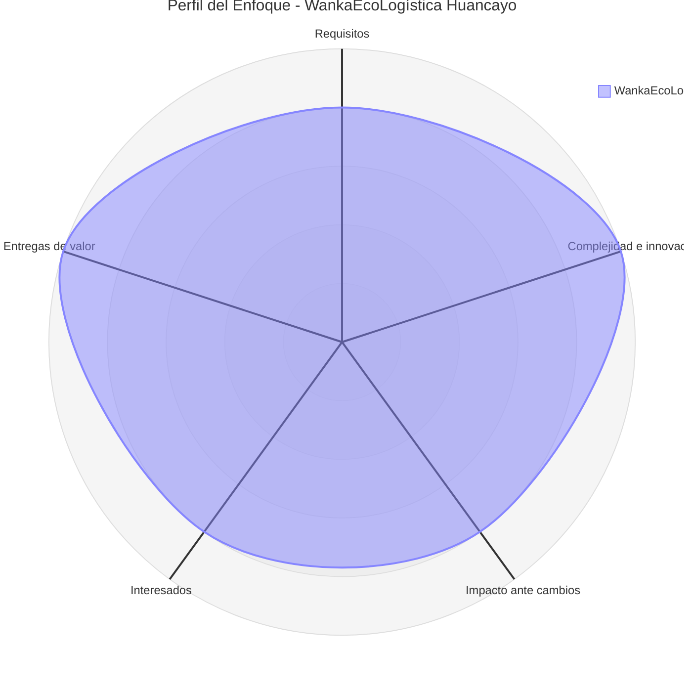

# Selección del Enfoque del Proyecto

## Encabezado de Metadatos

| Campo | Información |
|---|---|
| **Nombre del Proyecto** | **WankaEcoLogística Huancayo** |
| **Integrantes** | Michel Frederik Ccente Quispe |
|  | Nario German Reyes Rios |
|  | Henry Lozano Porta |
|  | Jhon Espinoza Mendoza |
|  | Gimena Salazar Espinoza |
| **Fecha** | 29/08/2026 |
| **Versión** | 1.0.0 |

---

## 1. Propósito del Documento

Este documento define y justifica el enfoque de desarrollo y gestión más conveniente para **WankaEcoLogística Huancayo**, una plataforma web orientada a optimizar rutas sostenibles de última milla para operaciones logísticas en **Huancayo - Junín - Perú**.

El proyecto combina validación funcional, interacción frecuente con interesados, ajustes continuos y componentes técnicos especializados, por lo que requiere un enfoque flexible que permita aprender del contexto real de la ciudad y del equipo.

La evaluación usa una escala de **1 a 5**:

- **1** representa una orientación claramente **Predictiva / Waterfall**.
- **5** representa una orientación claramente **Ágil / Adaptativa**.
- Los valores intermedios reflejan proyectos con características mixtas.

---

## 2. Matriz de Ponderación de Variables

| Variable | Peso | Calificación (1-5) | Puntaje Ponderado | Justificación |
|---|---:|---:|---:|---|
| **Claridad y estabilidad de requisitos** | 25% | **4** | **1.00** | Los objetivos generales están claros desde el inicio, pero detalles como zonas de entrega, restricciones viales, horarios de tráfico y necesidades de los usuarios pueden ajustarse con la validación en campo. |
| **Complejidad técnica e innovación** | 20% | **5** | **1.00** | La solución requiere integración de mapa, georreferenciación, dashboard, indicadores de sostenibilidad y un motor de optimización de rutas. Esa complejidad favorece iteraciones cortas y validación progresiva. |
| **Severidad del impacto ante cambios** | 20% | **4** | **0.80** | Cambios en rutas, pedidos, flota o reglas de optimización afectan el valor del sistema, pero una arquitectura modular permite incorporarlos sin rehacer todo el producto. |
| **Disponibilidad de los interesados** | 15% | **4** | **0.60** | Se espera que el docente, el equipo y los usuarios de prueba participen por incrementos, lo que hace viable la retroalimentación continua. |
| **Frecuencia de entregas de valor** | 20% | **5** | **1.00** | El proyecto puede entregar valor desde los primeros incrementos: carga de pedidos, rutas base, mapa, métricas y reportes iniciales. |
| **TOTAL** | **100%** |  | **4.40 / 5.00** | **Orientación fuerte hacia un enfoque Ágil / Adaptativo.** |

### 2.1. Cálculo del Resultado

- Claridad y estabilidad de requisitos: **4 × 0.25 = 1.00**
- Complejidad técnica e innovación: **5 × 0.20 = 1.00**
- Severidad del impacto ante cambios: **4 × 0.20 = 0.80**
- Disponibilidad de los interesados: **4 × 0.15 = 0.60**
- Frecuencia de entregas de valor: **5 × 0.20 = 1.00**

**Puntaje total = 4.40 / 5.00**

### 2.2. Interpretación

| Rango | Orientación del Enfoque |
|---|---|
| **1.00 - 2.00** | Predictivo / Waterfall |
| **2.01 - 3.99** | Híbrido |
| **4.00 - 5.00** | Ágil / Adaptativo |

El resultado ubica a **WankaEcoLogística Huancayo** en una orientación **Ágil / Adaptativa**.

---

## 3. Diagrama de Radar del Enfoque

### 3.1. Tabla Descriptiva del Radar

| Dimensión | Calificación | Orientación |
|---|---:|---|
| Claridad y estabilidad de requisitos | **4 / 5** | Alta orientación adaptativa |
| Complejidad técnica e innovación | **5 / 5** | Muy alta orientación adaptativa |
| Severidad del impacto ante cambios | **4 / 5** | Alta capacidad de adaptación |
| Disponibilidad de interesados | **4 / 5** | Alta participación |
| Frecuencia de entregas de valor | **5 / 5** | Muy alta orientación incremental |

**Promedio: 4.40 / 5.00**

---

## 4. Decisión del Enfoque

### 4.1. Enfoque Seleccionado: **Ágil / Adaptativo**

La naturaleza del proyecto, el componente técnico de optimización y la necesidad de validar el sistema con el contexto real de Huancayo hacen recomendable un enfoque **Ágil / Adaptativo**.

Este enfoque permite:

- ajustar requisitos por iteración;
- validar rutas, mapas y métricas con datos reales;
- responder a cambios de tráfico, clima y operación;
- entregar valor temprano al equipo y a los interesados.

---

## 5. Justificación Técnica del Enfoque Seleccionado

### 5.1. Evolución de los requisitos

Aunque el alcance está definido, detalles como áreas de cobertura, reglas de ruteo, indicadores ambientales y necesidades de los usuarios pueden evolucionar durante las revisiones.

### 5.2. Complejidad e innovación

La solución integra optimización de rutas, visualización geográfica, métricas de sostenibilidad y reportes ejecutivos. Esa combinación exige aprender rápido y corregir sobre la marcha.

### 5.3. Gestión del cambio

En Huancayo pueden cambiar condiciones de circulación, accesibilidad o prioridades de entrega. Un modelo adaptativo permite incorporar esos cambios sin detener el proyecto.

### 5.4. Participación de los interesados

El equipo, el docente asesor y los usuarios de prueba pueden revisar incrementos funcionales de forma periódica, lo que fortalece la calidad del producto y reduce retrabajo.

### 5.5. Entrega incremental de valor

Cada iteración puede liberar funciones útiles: registro de pedidos, asignación de vehículos, mapa de rutas, dashboard y reportes. Así el proyecto genera valor desde temprano.

---

## 6. Alineamiento con PMBOK 7.ª Edición

El enfoque seleccionado se alinea con PMBOK 7 en los siguientes puntos:

- **Adaptación al contexto:** el proyecto se ajusta a la realidad de Huancayo y al trabajo del equipo.
- **Enfoque en el valor:** cada entrega debe aportar utilidad real a la operación logística.
- **Participación de interesados:** las validaciones periódicas mantienen el producto alineado con las necesidades.
- **Respuesta al cambio:** se prioriza la capacidad de ajustar rutas, reglas y visualizaciones.
- **Calidad incorporada:** las pruebas y revisiones se realizan en cada iteración.
- **Gestión de incertidumbre:** el proyecto reduce riesgos al descubrir problemas temprano.

---

## 7. Aplicación del Enfoque Ágil en WankaEcoLogística Huancayo

El trabajo puede organizarse en iteraciones cortas con una lista priorizada de funcionalidades.

Durante cada iteración se realizará:

1. Priorización de requisitos.
2. Planificación del incremento.
3. Diseño y desarrollo.
4. Pruebas funcionales.
5. Revisión con interesados.
6. Retroalimentación.
7. Ajustes para el siguiente ciclo.

Este esquema refleja el estilo del equipo: coordinación directa, avances visibles y mejora continua con identidad huancaína.

---

## 8. Conclusión

La evaluación arroja un puntaje de **4.40 / 5.00**, lo que confirma que el proyecto requiere un enfoque **Ágil / Adaptativo**.

WankaEcoLogística Huancayo se beneficia de:

- adaptación continua;
- entregas incrementales;
- validación temprana;
- y retroalimentación frecuente.

Por ello, se establece formalmente como enfoque de gestión y desarrollo:

> **ENFOQUE ÁGIL / ADAPTATIVO**

Este enfoque le da al proyecto la flexibilidad necesaria para crecer con Huancayo y con el trabajo colaborativo del equipo.

---

**Fin del documento**
