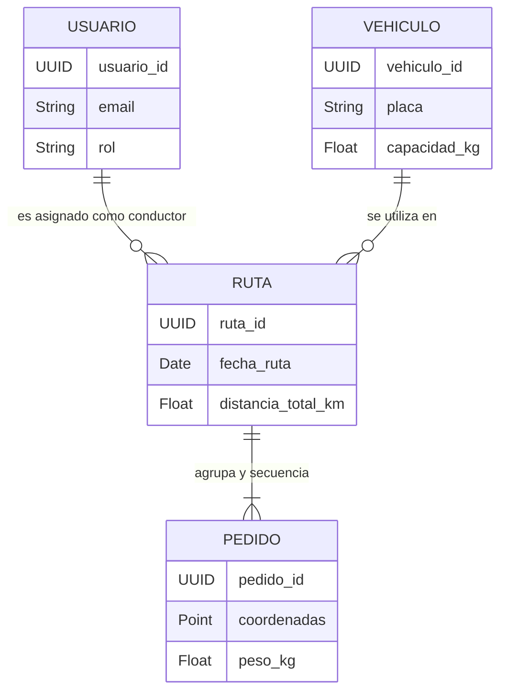

# Diseño e Ingeniería de Base de Datos

## Encabezado de Metadatos

| Campo | Información |
|---|---|
| **Nombre del Proyecto** | **WankaEcoLogística Huancayo** |
| **Integrantes** | Michel Frederik Ccente Quispe |
|  | Nario German Reyes Rios |
|  | Henry Lozano Porta |
|  | Jhon Espinoza Mendoza |
|  | Gimena Salazar Espinoza |
| **Fecha** | 04/09/2026 |
| **Versión** | 1.0.0 |

---

## 1. Modelo Conceptual

El siguiente diagrama Entidad-Relación define la semántica principal del negocio para la gestión de flota, personal y optimización de despachos.



---

## 2. Modelo Lógico

Todas las entidades han sido normalizadas hasta la **Tercera Forma Normal (3FN)** para evitar redundancias y anomalías de actualización. Se utiliza un enfoque relacional con capacidades espaciales.

| Entidad | Descripción Funcional | Clave Primaria (PK) | Claves Foráneas (FK) | Nivel de Normalización |
|---|---|---|---|---|
| **usuarios** | Almacena credenciales y roles (Administrador, Operador, Conductor). | `usuario_id` | N/A | 3FN |
| **vehiculos** | Registro de la flota física, capacidades máximas y métricas de consumo. | `vehiculo_id` | N/A | 3FN |
| **rutas** | Cabecera del cálculo algorítmico, asocia al empleado y su herramienta de trabajo para un día. | `ruta_id` | `conductor_id` -> usuarios<br>`vehiculo_id` -> vehiculos | 3FN |
| **pedidos** | Puntos geográficos de entrega, ventanas de tiempo de servicio y relación al orden de la ruta óptima. | `pedido_id` | `ruta_id` -> rutas | 3FN |

---

## 3. Modelo Físico (DDL SQL) e Índices

El siguiente script DDL implementa la arquitectura en **PostgreSQL**, incorporando tipos de datos nativos como `UUID` y extendiendo las capacidades geoespaciales mediante **PostGIS** (`GEOMETRY`).

```sql
-- Habilitación de extensiones necesarias
CREATE EXTENSION IF NOT EXISTS "uuid-ossp";
CREATE EXTENSION IF NOT EXISTS "postgis";

-- Tabla: Usuarios
CREATE TABLE usuarios (
    usuario_id UUID PRIMARY KEY DEFAULT uuid_generate_v4(),
    email VARCHAR(255) NOT NULL UNIQUE,
    password_hash VARCHAR(255) NOT NULL,
    rol VARCHAR(50) NOT NULL,
    estado VARCHAR(20) NOT NULL DEFAULT 'ACTIVO',
    creado_en TIMESTAMP WITH TIME ZONE DEFAULT CURRENT_TIMESTAMP
);
CREATE INDEX idx_usuarios_email ON usuarios(email);

-- Tabla: Vehiculos
CREATE TABLE vehiculos (
    vehiculo_id UUID PRIMARY KEY DEFAULT uuid_generate_v4(),
    placa VARCHAR(20) NOT NULL UNIQUE,
    capacidad_kg NUMERIC(10,2) NOT NULL,
    consumo_km NUMERIC(10,2) NOT NULL,
    factor_emision NUMERIC(10,4) NOT NULL,
    estado VARCHAR(20) NOT NULL DEFAULT 'ACTIVO',
    creado_en TIMESTAMP WITH TIME ZONE DEFAULT CURRENT_TIMESTAMP
);
CREATE INDEX idx_vehiculos_placa ON vehiculos(placa);

-- Tabla: Rutas
CREATE TABLE rutas (
    ruta_id UUID PRIMARY KEY DEFAULT uuid_generate_v4(),
    conductor_id UUID NOT NULL,
    vehiculo_id UUID NOT NULL,
    fecha_ruta DATE NOT NULL,
    distancia_total_km NUMERIC(10,2),
    emisiones_co2 NUMERIC(10,2),
    estado VARCHAR(20) NOT NULL DEFAULT 'PLANIFICADA',
    creado_en TIMESTAMP WITH TIME ZONE DEFAULT CURRENT_TIMESTAMP,
    CONSTRAINT fk_rutas_conductor FOREIGN KEY (conductor_id) REFERENCES usuarios(usuario_id) ON DELETE RESTRICT,
    CONSTRAINT fk_rutas_vehiculo FOREIGN KEY (vehiculo_id) REFERENCES vehiculos(vehiculo_id) ON DELETE RESTRICT
);
CREATE INDEX idx_rutas_fecha ON rutas(fecha_ruta);
CREATE INDEX idx_rutas_conductor ON rutas(conductor_id);

-- Tabla: Pedidos
CREATE TABLE pedidos (
    pedido_id UUID PRIMARY KEY DEFAULT uuid_generate_v4(),
    ruta_id UUID,
    direccion VARCHAR(255) NOT NULL,
    coordenadas GEOMETRY(Point, 4326) NOT NULL,
    peso_kg NUMERIC(10,2) NOT NULL,
    ventana_inicio TIME NOT NULL,
    ventana_fin TIME NOT NULL,
    prioridad VARCHAR(20) NOT NULL DEFAULT 'NORMAL',
    estado VARCHAR(20) NOT NULL DEFAULT 'PENDIENTE',
    orden_entrega INTEGER,
    creado_en TIMESTAMP WITH TIME ZONE DEFAULT CURRENT_TIMESTAMP,
    CONSTRAINT fk_pedidos_ruta FOREIGN KEY (ruta_id) REFERENCES rutas(ruta_id) ON DELETE SET NULL
);
CREATE INDEX idx_pedidos_ruta ON pedidos(ruta_id);
-- Índice Espacial GIST para optimización de queries geográficas (PostGIS)
CREATE INDEX idx_pedidos_coordenadas ON pedidos USING GIST (coordenadas);
```

---

**Fin del documento**
