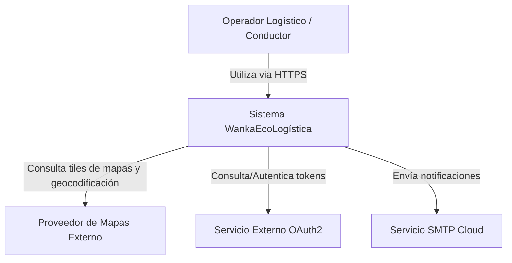
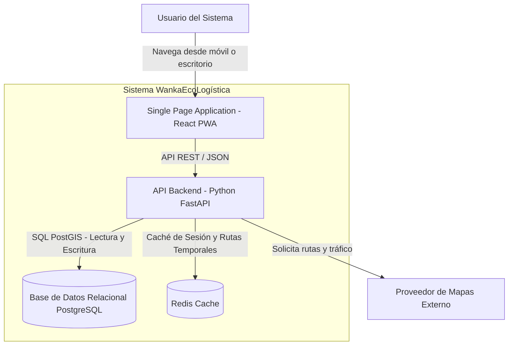
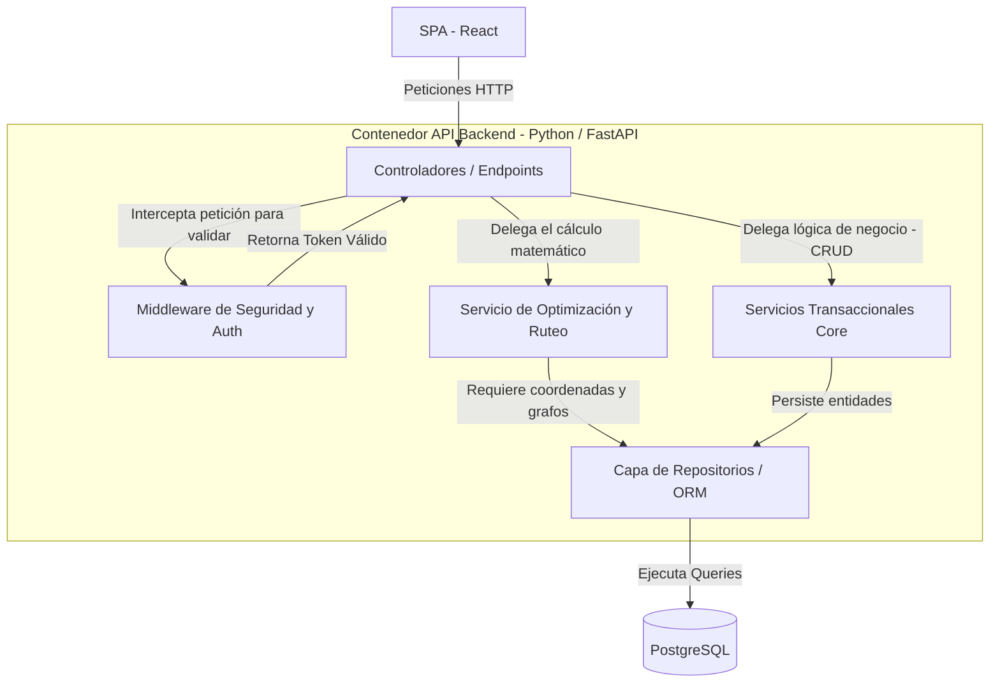

# Arquitectura de Software - Modelo C4

## Encabezado de Metadatos

| Campo | Información |
|---|---|
| **Nombre del Proyecto** | **WankaEcoLogística Huancayo** |
| **Integrantes** | Michel Frederik Ccente Quispe |
|  | Nario German Reyes Rios |
|  | Henry Lozano Porta |
|  | Jhon Espinoza Mendoza |
|  | Gimena Salazar Espinoza |
| **Fecha** | 04/09/2026 |
| **Versión** | 1.0.0 |

---

## 1. Nivel 1: Diagrama de Contexto

Este nivel muestra el panorama general del sistema **WankaEcoLogística**, los usuarios (actores logísticos) que interactúan con él y los sistemas externos de los que depende para su funcionamiento integral (como servicios de mapas geográficos y mensajería).

---

## 2. Nivel 2: Diagrama de Contenedores

Este diagrama expone las piezas principales de software que componen la plataforma, sus interacciones y las responsabilidades asignadas a cada tecnología seleccionada previamente en la evaluación del stack (Módulo 10).

---

## 3. Nivel 3: Diagrama de Componentes

Este diagrama detalla la estructuración interna de los módulos que componen el contenedor principal de la API Backend (FastAPI). Se evidencia una arquitectura por capas limpias, separando las interfaces de red, la lógica algorítmica y el acceso a datos.

---

**Fin del documento**
