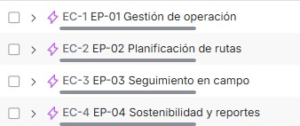
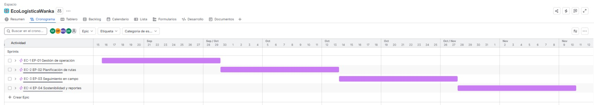
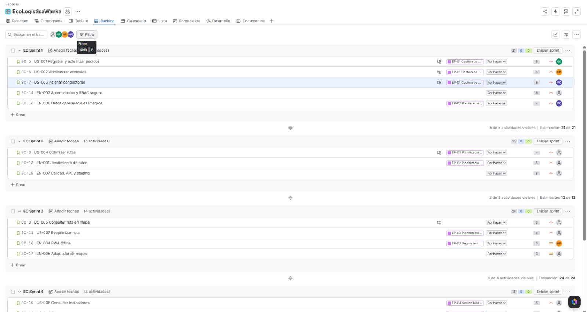
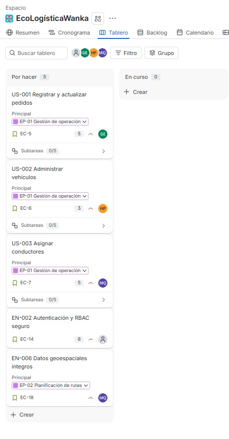
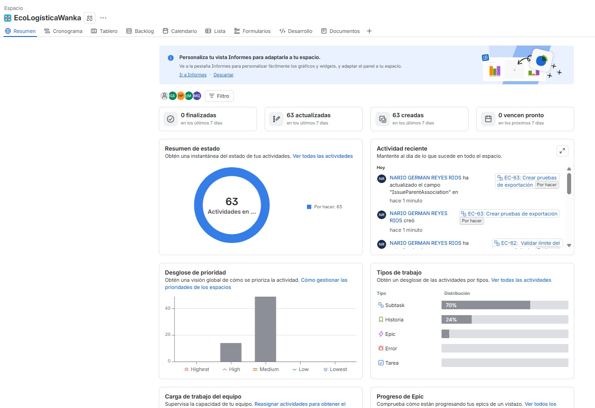

# Artefactos Jira

[← Volver al README Principal](../../README.md)

| Campo | Información |
|---|---|
| Proyecto | WankaEcoLogística Huancayo |
| Versión | V_1_0_0 |
| Fecha | 11/09/2026 |
| Estado | Guía de configuración y evidencia pendiente |

Este documento especifica la configuración que debe registrarse en Jira Software para el backlog de la Fase 02. No existe evidencia visual de una instancia Jira en el repositorio; por tanto, los espacios siguientes son marcadores y no capturas fabricadas.

## 1. Configuración mínima

Proyecto tipo **Scrum**; issue types: Épica, Historia y Enabler (o Tarea técnica si la instancia no permite el tipo Enabler). Campos obligatorios: prioridad, Story Points, épica, componente, sprint y fix version. Componentes: `Operación`, `Ruteo`, `Mapa/PWA`, `Sostenibilidad`, `Plataforma`.

Las imágenes siguientes proceden de la instancia Jira del proyecto. Se incluyen como evidencia visual sin alterar su contenido.

### Evidencia 1: Roadmap del Proyecto

| Épica | Relación / dependencia | Ventana propuesta | Release |
|---|---|---|---|
| EP-01 Gestión de operación | Habilita planificación | Sprints 1–2 | v1.0.0-MVP |
| EP-02 Planificación de rutas | Depende de EP-01 y datos geográficos | Sprints 2–4 | v1.0.0-MVP |
| EP-03 Seguimiento en campo | Consume rutas de EP-02 | Sprints 3–4 | v1.0.0-MVP |
| EP-04 Sostenibilidad y reportes | Consume resultados de EP-02 | Sprints 4–5 | v1.0.0-MVP |

Las líneas de tiempo son una propuesta de planificación, sujeta a la capacidad real del equipo y la validación del roadmap en Jira.

## 2. Backlog priorizado

### Evidencia 2: Backlog priorizado

| ID | Tipo | Título | Épica | Prioridad | SP | Componente |
|---|---|---|---|---|---:|---|
| US-001 | Historia | Registrar y actualizar pedidos | EP-01 | Alta | 5 | Operación |
| US-002 | Historia | Administrar vehículos | EP-01 | Alta | 3 | Operación |
| US-003 | Historia | Asignar conductores | EP-01 | Alta | 5 | Operación |
| EN-002 | Enabler | Autenticación y RBAC seguro | Transversal | Alta | 8 | Plataforma |
| EN-006 | Enabler | Datos geoespaciales íntegros | EP-02 | Alta | 5 | Ruteo |
| US-004 | Historia | Optimizar rutas | EP-02 | Alta | 13 | Ruteo |
| EN-001 | Enabler | Rendimiento de ruteo | EP-02 | Alta | 5 | Ruteo |
| EN-007 | Enabler | Calidad, API y staging | Transversal | Alta | 8 | Plataforma |
| US-005 | Historia | Consultar ruta en mapa | EP-03 | Alta | 8 | Mapa/PWA |
| US-006 | Historia | Consultar indicadores | EP-04 | Alta | 5 | Sostenibilidad |
| US-007 | Historia | Reoptimizar ruta | EP-02 | Alta | 8 | Ruteo |
| US-008 | Historia | Exportar reporte | EP-04 | Media | 3 | Sostenibilidad |
| EN-003 | Enabler | Recuperación de servicio | Transversal | Media | 5 | Plataforma |
| EN-004 | Enabler | PWA offline | EP-03 | Media | 5 | Mapa/PWA |
| EN-005 | Enabler | Adaptador de mapas | Transversal | Media | 3 | Plataforma |

## 3. Sprint Planning

### Evidencia 3: Sprint 1

**Duración:** 2 semanas.  
**Capacidad propuesta:** 26 Story Points, que debe confirmarse con la velocidad real.  
**Ítems:** US-001 (5), US-002 (3), US-003 (5), EN-002 (8) y EN-006 (5).

### Sprint Goal

Disponer en staging de una base segura para registrar pedidos, vehículos y conductores, validando permisos, disponibilidad, datos geográficos y reglas operativas necesarias para planificar rutas.

## 4. Tablero Scrum

### Evidencia 4: Tablero Scrum

`To Do → In Progress → In Review / QA → Done`

| Estado | Significado y criterio de entrada/salida |
|---|---|
| To Do | Ítem refinado, priorizado, estimado y listo para iniciar. |
| In Progress | Desarrollo o configuración iniciados por un responsable. |
| In Review / QA | Cambio terminado por desarrollo; espera revisión de código y pruebas contra sus BDD. |
| Done | Cumple la Definition of Done, incluida evidencia de staging y documentación. |

## 5. Release

### Evidencia 5: Release v1.0.0-MVP

> 📸 Pendiente: insertar una captura específica de la pantalla **Releases / Versiones** de Jira donde se visualice `v1.0.0-MVP`. Las imágenes disponibles evidencian épicas, backlog, sprints y tablero, pero no una release; se mantiene este marcador para no atribuir evidencia inexistente.

**Versión:** `v1.0.0-MVP`. **Objetivo:** primera versión demostrable de gestión operativa, optimización, seguimiento y reporte sostenible. Incluye US-001 a US-008 y EN-001 a EN-007, condicionados a la aceptación de cada ítem y al alcance real aprobado al cierre. La versión se crea en Jira con la fecha de liberación que acuerde el equipo; esta documentación no afirma que haya sido liberada.

Como evidencia complementaria del espacio Jira, sin sustituir la evidencia específica de la release, se conserva el resumen visible del proyecto:

## 6. Reglas para las evidencias

Cada captura debe recortar exclusivamente el panel de Jira que demuestra el punto indicado: sin escritorio, barra de tareas, pestañas irrelevantes ni áreas externas al producto. Antes de adjuntarla, se debe ocultar cualquier dato sensible.

## Historial de Control de Cambios

| Versión | Fecha | Cambio | Responsable |
|---|---|---|---|
| V_1_0_0 | 11/09/2026 | Creación de la guía de artefactos Jira | Equipo |
